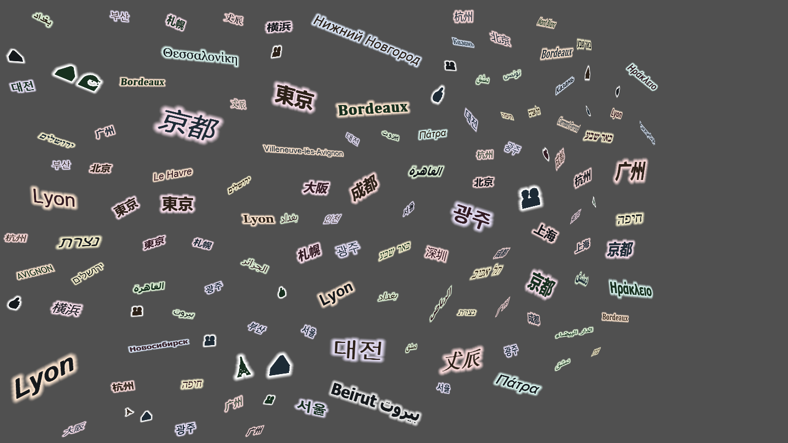
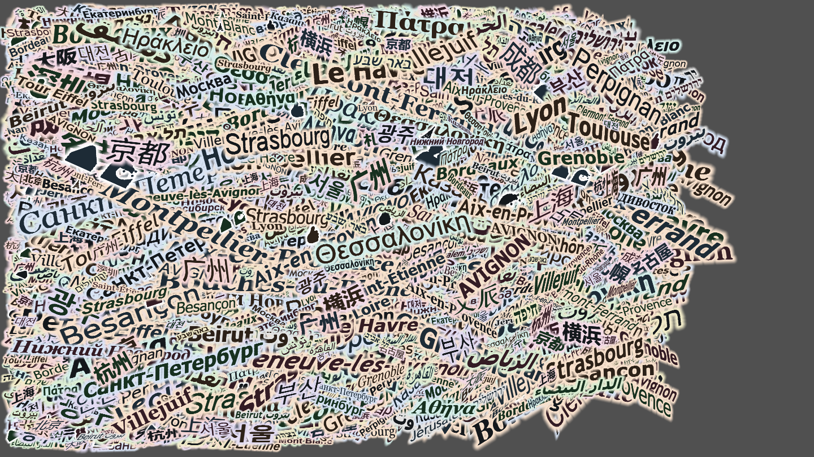
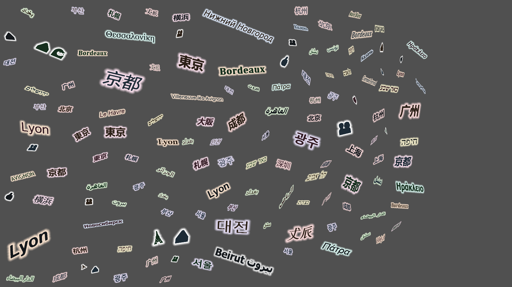
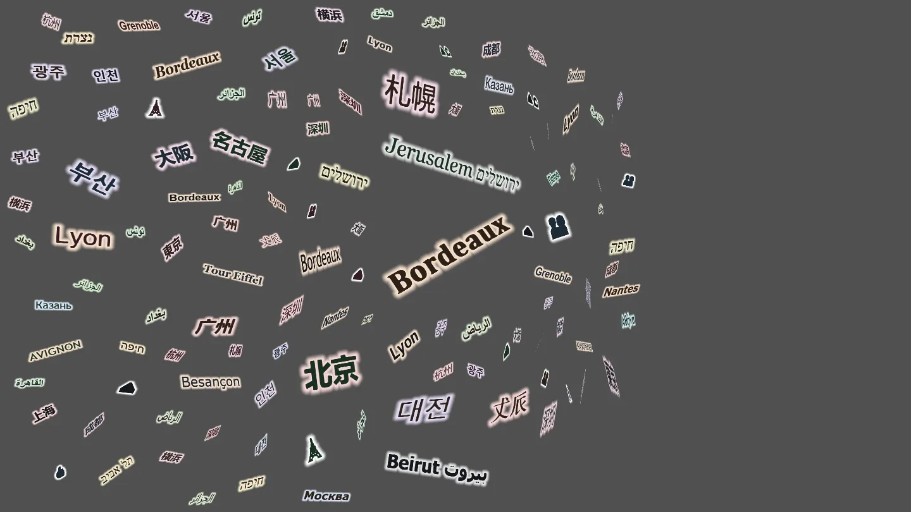
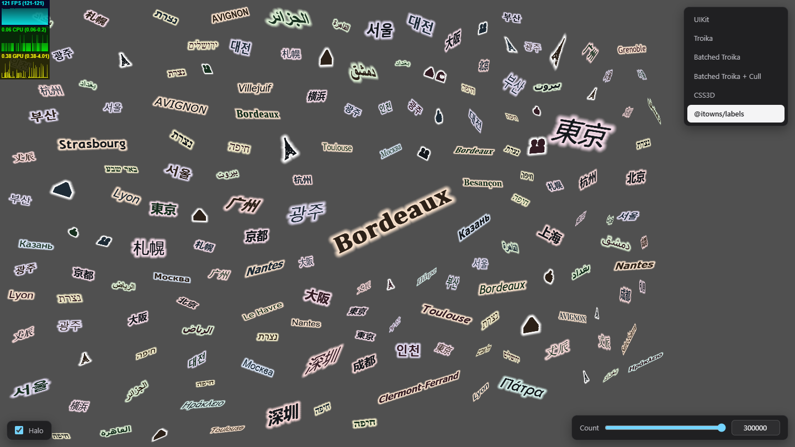
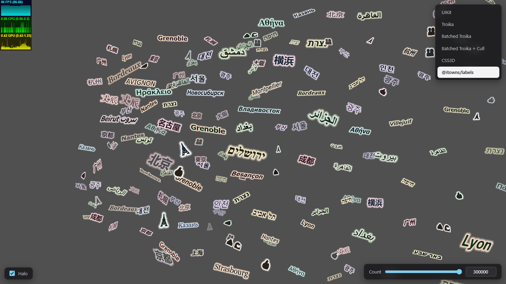

# Instanced SDF Labels for Three.js

[](./LICENSE)


A prototype and benchmark for a future overhaul of the [iTowns](http://www.itowns-project.org/) labelling system.

The renderer lives in its own package, [`@itowns/labels`](./packages/labels/): text labels for Three.js drawn through one instanced mesh from a glyph atlas built at runtime, and placed on screen so they do not overlap. A React Three Fiber app draws the same labels with it and with other Three.js text renderers.

<p align="center">
  
  <br>
  <em>20 000 labels in seven scripts plus emoji, 16 to 48 px, five font families, one shared atlas. The halo colour marks the language.</em>
</p>

## Motivation

Instanced text renderers for Three.js draw from font files (`.ttf`, `.woff`, or prebuilt atlases) shipped with the application, and leave label placement to the caller.

`@itowns/labels` rasterizes glyphs at runtime from any font the browser can draw, with [`@mapbox/tiny-sdf`](https://github.com/mapbox/tiny-sdf), into one signed distance field atlas. A screen-space collision pass decides which labels are drawn.

## Capabilities

**Text and layout.** Line breaks at `\n` and wrapping to a `maxWidth`, left, center, right and justified alignment, anchors on both axes including the baseline, letter spacing, line height, offsets and collision padding. Units follow the [Mapbox style specification](https://docs.mapbox.com/style-spec/reference/layers/#symbol): sizes in CSS px, spacing and offsets in em.

**Fonts and scripts.** One atlas for every font in the scene. Weight and style can be given in the font name (`'Open Sans Semi Bold Italic'`) or as numbers. Arabic shaping and bidirectional reordering come from [`@mapbox/mapbox-gl-rtl-text`](https://github.com/mapbox/mapbox-gl-rtl-text). Joined emoji, skin tones and combining accents draw as one glyph.

**Styling.** Ink colour and opacity, and a halo with its own colour, opacity, width and blur, both from one distance field in a single pass.

**Placement.**

* Screen-space collision on a packed-bit occupancy grid, one bit per `downscale`-square cell
* Nearest labels placed first, with a sort penalty on labels the last pass did not place
* Labels fade in and out as they win and lose their place
* Near and far distance limits, and frustum rejection before collision
* Map-aligned or viewport-aligned rotation per label
* Placement passes at most every `placementIntervalMs`, spread over frames within `placementBudgetMs`

| Without placement | With placement |
| :---: | :---: |
|  |  |
| every projectable label drawn | overlaps resolved on the occupancy grid |

*20 000 labels, same scene and camera, placement off and on.*

<p align="center">
  
  <br>
  <em>Labels fading in and out as the camera moves. 50 000 labels, halo on.</em>
</p>

## Benchmark

Every renderer draws the same seeded labels, with the same per-label size, weight, style and colours where it supports them. Troika and UIKit draw a single font family; UIKit draws the halo as a backing plate.

### Drawing every label

Highest count holding a 16.7 ms (60 FPS) median frame while the camera is dragged.

| Renderer | 60 FPS ceiling | Median there | Next count measured |
| --- | --- | --- | --- |
| UIKit | 1 000 | 16.1 ms | 1 500: 23.6 ms |
| CSS3D | 1 000 | 9.2 ms | 1 500: 18.2 ms |
| Troika | 2 500 | 14.4 ms | 3 000: 23.1 ms |
| Batched Troika | below 7 500 | | 7 500: 19.4 ms |
| Batched Troika + frustum cull | 10 000 | 14.0 ms | 20 000: 29.2 ms |

### Placing labels

`@itowns/labels` holds every label and draws the subset that fits without overlap.

| Labels held | Drag median | Drag p95 | Drag p99 | Still median |
| --- | --- | --- | --- | --- |
| 50 000 | 0.9 ms | 1.7 ms | 4.4 ms | 0.4 ms |
| 150 000 | 5.3 ms | 8.7 ms | 9.9 ms | 2.3 ms |
| 300 000 | 13.0 ms | 15.0 ms | 16.2 ms | 5.1 ms |

| Still | Dragging |
| :---: | :---: |
|  |  |

| Measured | |
| --- | --- |
| Date | 2026-09-25 |
| Library | [`021bde7`](https://github.com/Nynjin/Three3DText/commit/021bde7) |
| GPU | NVIDIA GeForce RTX 5060 Laptop, ANGLE Direct3D 11 |
| Browser | headless Chrome 154, Windows 11 |
| App | production build, 1600 x 900, DPR 1, halo on |
| Frames | `requestAnimationFrame`, 180 per pass, vsync and frame-rate limit off, first pass discarded |

## Repository layout

```
packages/labels/   @itowns/labels, the renderer
app/               the React Three Fiber benchmark app
scripts/           dev runner and notice generator
```

React, React Three Fiber and Next.js belong to the benchmark app only. The app imports the built package through the npm workspace link. See the [package README](./packages/labels/README.md) for the API.

## Getting started

```bash
npm ci
npm run dev
```

`npm run dev` builds the library, rebuilds its JavaScript on every change, and serves the app at `http://localhost:3000`.

```bash
npm run build       # library, then a production build of the app
npm run start       # serve the production build
npm run build:lib   # library only: packages/labels/dist, ESM and declarations
npm run typecheck   # build the library, then typecheck the app against it
npm run lint        # ESLint, type-aware
npm run notices     # regenerate the third-party notices
```

## License

Dual **CeCILL-B / MIT**, inherited from iTowns. See [LICENSE](./LICENSE).

Dependency notices are in [THIRD-PARTY-NOTICES.md](./THIRD-PARTY-NOTICES.md), generated from the installed tree with `npm run notices`. The package carries its own [LICENSE](./packages/labels/LICENSE) and [notices](./packages/labels/THIRD-PARTY-NOTICES.md) for its own dependencies.

## Acknowledgements

**Author:** [Moncef Hassani](https://github.com/nynjin)

Developed at [Ciril Group](https://www.cirilgroup.com/) as a research and optimization effort for the iTowns project.

---
Copyright (c) 2025-2026 Moncef Hassani | Ciril Group
