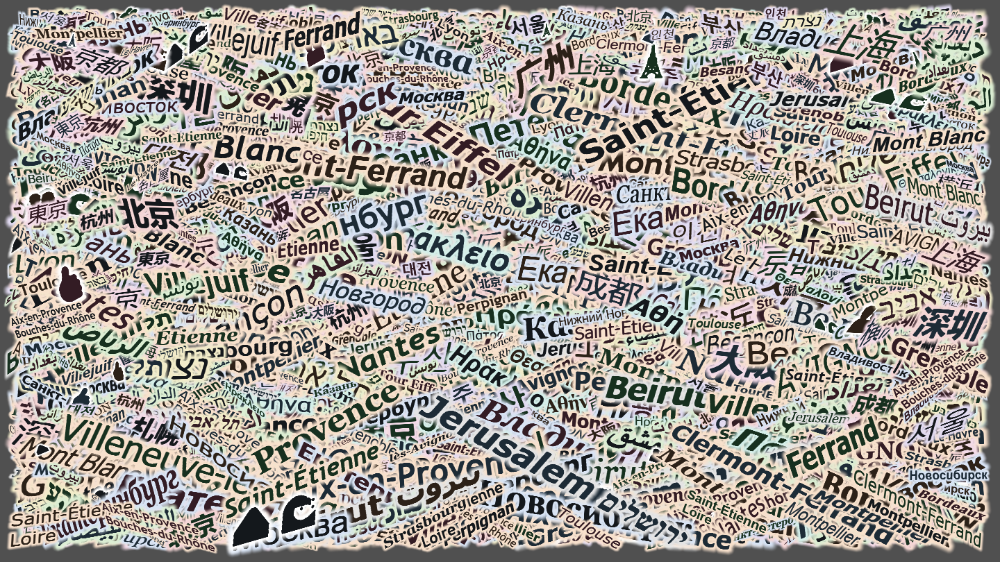
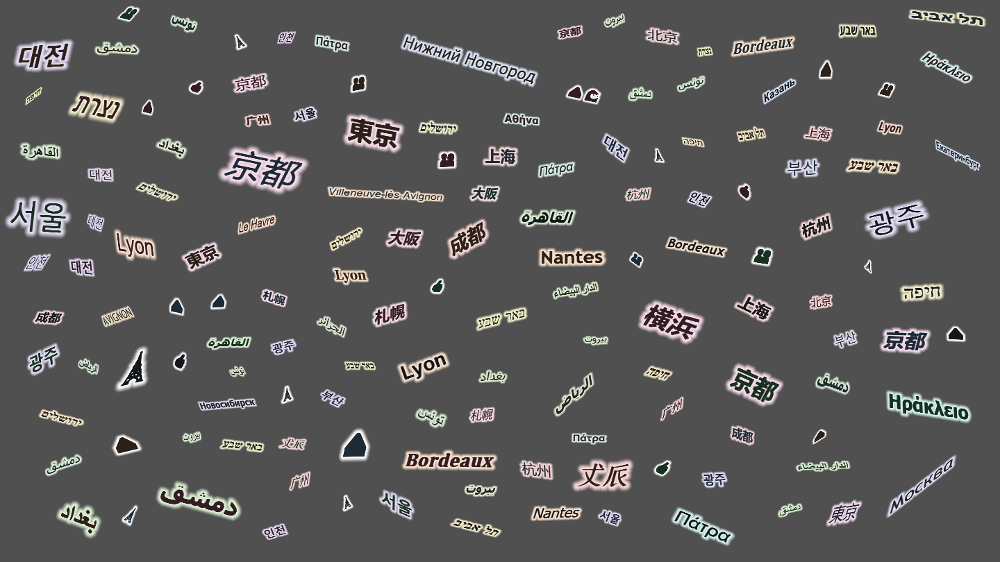
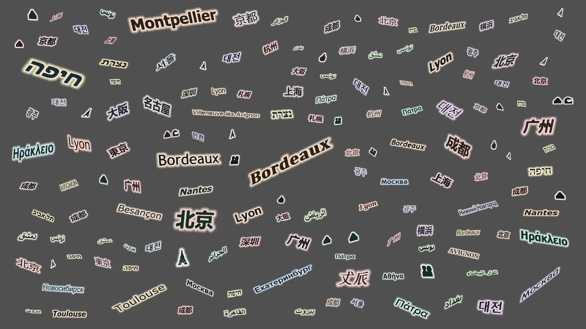
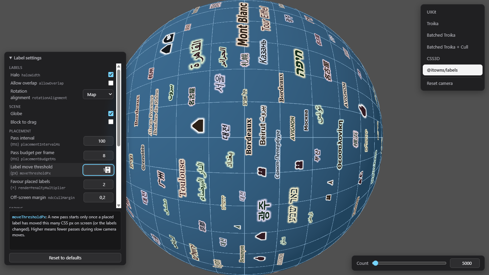

# Instanced SDF Labels for Three.js

[](./LICENSE)


A prototype and benchmark for a future overhaul of the [iTowns](http://www.itowns-project.org/) labelling system.

The renderer lives in its own package, [`@itowns/labels`](./packages/labels/): text labels for Three.js drawn through one instanced mesh from a glyph atlas built at runtime, and placed on screen so they do not overlap. A React Three Fiber app draws the same labels with it and with other Three.js text renderers.

<p align="center">
  
  <br>
  <em>20 000 labels in seven scripts plus emoji, 16 to 48 px, five font families, one shared atlas. The halo colour marks the language.</em>
</p>

## Motivation

Instanced text renderers for Three.js draw from font files shipped with the app, and leave placement to the caller. `@itowns/labels` rasterizes glyphs at runtime from any font the browser can draw ([`@mapbox/tiny-sdf`](https://github.com/mapbox/tiny-sdf)), and a screen-space collision pass picks which labels draw.

## Capabilities

**Text and layout**

* Line breaks at `\n`, wrapping to `maxWidth`
* Left, center, right, justified alignment; anchors on both axes, baseline included
* Letter spacing, line height, offsets, collision padding
* Units of the [Mapbox style specification](https://docs.mapbox.com/style-spec/reference/layers/#symbol): px sizes, em spacing and offsets

**Fonts and scripts**

* One atlas for every font
* MapLibre/Mapbox `text-font` arrays as they are (`['Open Sans Semibold', 'Arial Unicode MS Bold']`), or a CSS family list with weight and style
* Arabic shaping and bidirectional text ([`@mapbox/mapbox-gl-rtl-text`](https://github.com/mapbox/mapbox-gl-rtl-text))
* Joined emoji and skin tones as one glyph; combining accents too, outside RTL text

**Styling**

* Ink colour and opacity; halo colour, opacity, width and blur, from one distance field

**Placement**

* Collision on a bit grid at 1/`downscale` of the canvas
* Nearest first; labels the last pass did not place are penalized
* Fade in and out on winning and losing a place
* Near and far limits, frustum rejection before collision
* Map- or viewport-aligned rotation per label
* `allowOverlap` per label; `depthTest` switch
* Passes at most every `placementIntervalMs`, about `placementBudgetMs` per frame

| Without placement | With placement |
| :---: | :---: |
|  |  |
| every projectable label drawn | overlaps resolved on the occupancy grid |

*20 000 labels, same scene and camera, placement off and on.*

<p align="center">
  
  <br>
  <em>Labels fading in and out as the camera moves. 50 000 labels, halo on.</em>
</p>

## Benchmark

Frame times against other Three.js text renderers: [docs/benchmark.md](./docs/benchmark.md).

## Repository layout

```
packages/labels/   @itowns/labels, the renderer
app/               the React Three Fiber benchmark app
docs/              benchmark results and images
scripts/           dev runner and notice generator
```

React, React Three Fiber and Next.js belong to the benchmark app only. The app imports the built package through the npm workspace link. See the [package README](./packages/labels/README.md) for the API.

## Getting started

```bash
npm ci
npm run dev
```

`npm run dev` builds the library, rebuilds its JavaScript on every change, and serves the app at `http://localhost:3000`.

**Label settings** panel, `@itowns/labels` mode:

* Manager options, live; hover a row for its description. `downscale` and `atlasFontSize` restart the labels.
* Label style: halo, rotation alignment, allow overlap.
* Scene: a globe in geocentric metres with a logarithmic depth buffer, and a block to drag in front of the labels.

**Reset camera**, under the renderer list, returns the camera to its start.

<p align="center">
  
  <br>
  <em>Globe mode, 5 000 labels, with the Label settings panel.</em>
</p>

```bash
npm run build       # library, then a production build of the app
npm run start       # serve the production build
npm run build:lib   # library only: packages/labels/dist, ESM and declarations
npm run typecheck   # build the library, then typecheck the app against it
npm run lint        # ESLint, type-aware
npm run notices     # regenerate the third-party notices
```

## License

Dual **CeCILL-B / MIT**, inherited from iTowns. See [LICENSE](./LICENSE).

Dependency notices are in [THIRD-PARTY-NOTICES.md](./THIRD-PARTY-NOTICES.md), generated from the installed tree with `npm run notices`. The package carries its own [LICENSE](./packages/labels/LICENSE) and [notices](./packages/labels/THIRD-PARTY-NOTICES.md) for its own dependencies.

## Acknowledgements

**Author:** [Moncef Hassani](https://github.com/nynjin)

Developed at [Ciril Group](https://www.cirilgroup.com/) as a research and optimization effort for the iTowns project.

---
Copyright (c) 2025-2026 Moncef Hassani | Ciril Group
