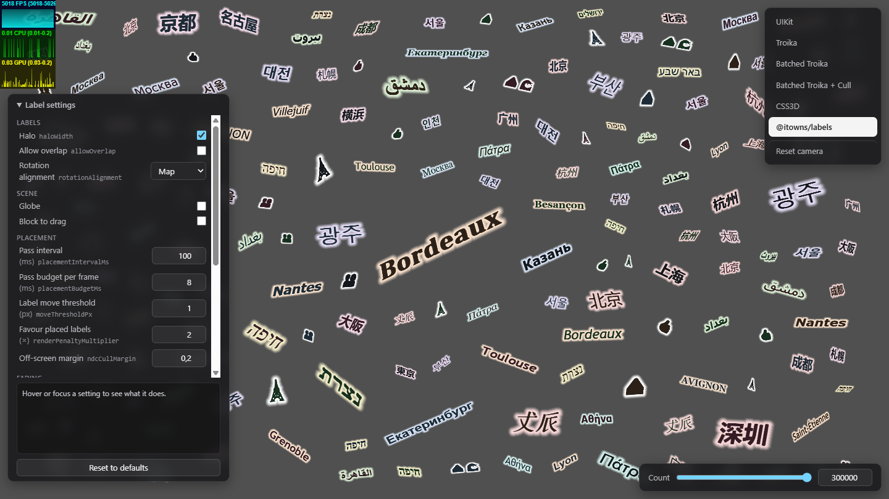
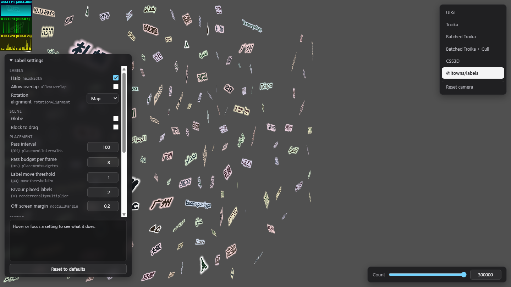

# Benchmark

Every renderer draws the same seeded labels: same relative size per label, and the
same weight, style and colours where supported. Troika and UIKit draw one font
family; UIKit draws the halo as a backing plate.

## Drawing every label

Highest count holding a 16.7 ms (60 FPS) median frame while the camera is dragged.
`@itowns/labels` runs with `allowOverlap` on every label: no label hidden by
collision, every on-screen label drawn.

| Renderer | 60 FPS ceiling | Median there | p95 there | Next count measured |
| --- | --- | --- | --- | --- |
| UIKit | 1 000 | 12.2 ms | 13.3 ms | 1 500: 19.1 ms |
| CSS3D | 1 500 | 13.8 ms | 44.9 ms | 2 000: 22.6 ms |
| Troika | 2 500 | 12.2 ms | 28.1 ms | 3 000: 18.5 ms |
| Batched Troika | 7 500 | 13.2 ms | 14.1 ms | 10 000: 17.2 ms |
| Batched Troika + frustum cull | 10 000 | 9.8 ms | 20.8 ms | 20 000: 24.7 ms |
| `@itowns/labels`, `allowOverlap` | 100 000 | 8.9 ms | 30.1 ms | 150 000: 20.2 ms |

`@itowns/labels` with `allowOverlap`, drag frame times:

| Labels | Median | p95 | p99 |
| --- | --- | --- | --- |
| 10 000 | 0.8 ms | 1.3 ms | 2.8 ms |
| 30 000 | 2.6 ms | 10.0 ms | 13.0 ms |
| 50 000 | 5.0 ms | 14.5 ms | 17.9 ms |
| 100 000 | 8.9 ms | 30.1 ms | 34.7 ms |

## Placing labels

`@itowns/labels` with placement: holds every label, draws the subset that fits
without overlap.

> [!NOTE]
> Not comparable with the table above: only placed labels are drawn, so GPU work
> per frame follows the placed count, not the 300 000 held. p95 and p99 are the
> frames that run a placement pass (`placementBudgetMs` 8 in the app).

| Labels held | Drag median | Drag p95 | Drag p99 | Still median |
| --- | --- | --- | --- | --- |
| 50 000 | 0.2 ms | 0.5 ms | 2.4 ms | 0.2 ms |
| 150 000 | 0.2 ms | 0.5 ms | 8.7 ms | 0.2 ms |
| 300 000 | 0.2 ms | 8.6 ms | 8.8 ms | 0.2 ms |

| Still | Dragging |
| :---: | :---: |
|  |  |

| Measured | |
| --- | --- |
| Date | 2026-10-09 |
| Library | `c449f5c` |
| GPU | NVIDIA GeForce RTX 5060 Laptop, ANGLE Direct3D 11 |
| Browser | headless Chrome 155, Windows 11 |
| App | production build, 1600 x 900, DPR 1, halo on, app's Label settings defaults |
| Frames | `requestAnimationFrame`, 180 per pass, vsync and frame-rate limit off, first pass discarded; a point repeats until two passes agree within 15% |
